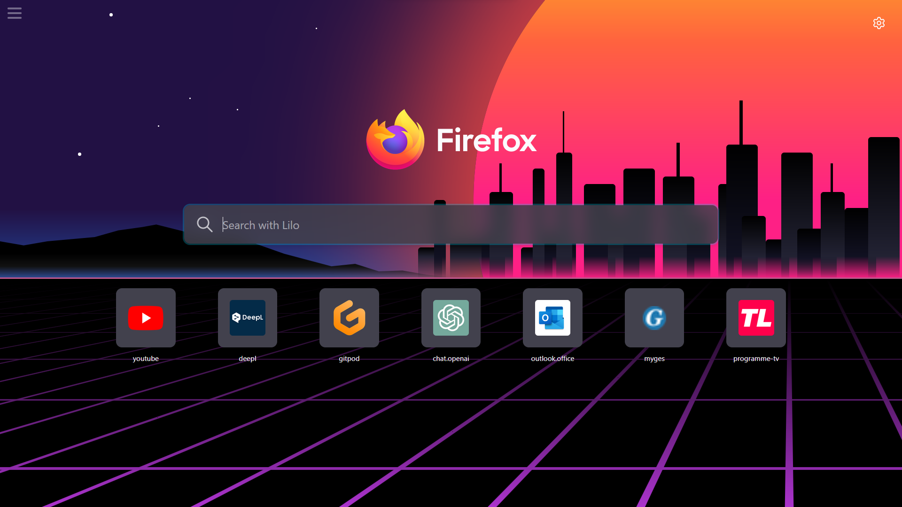

<h1>Homepage</h1>
Home page est un projet pour rajouter un fond d'écran animé à la page d'accueil de Firefox
<br/><br/>
Fork de HomePage de anic17.github.io/homepage
<br/><br/>



<h2>Installation</h2>

- cloner le projet

- lancer le build : ```npx vite build```

- pour lancer le serveur automatiquement faite un raccourcit startHideHomePage.vbs et copier le dans shell:startup

- se rendre dans ```about:preferences#home``` du navigateur et modifier la page d'accueil avec l'url de votre Home page

- installez une extension qui permet de modifier la page d'accueil dans un nouvel onglet avec une url customisée

<h2>Ajout d'un background</h2>

* Pour ajouter des backgrounds créer un dossier dans **/background** et mettez-y dedans au minima un index.html avec votre svg ou votre animation css dedans

* Une fois le background créé rajouter une ligne dans le switch case dans index.js avec le nom du dossier de votre background

* Modifier la variable ```var = nbBackground```

* Rajouter une ligne à ```vite.config.js``` avec le bon nom de dossier

* Lancer le build

<h2>Build</h2>

```npx vite build```
